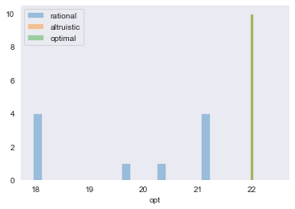
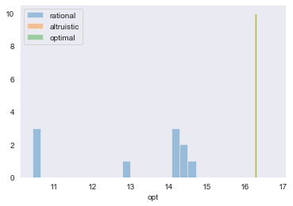
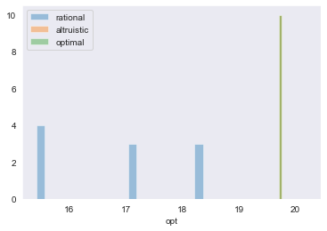
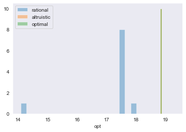
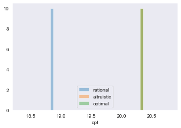
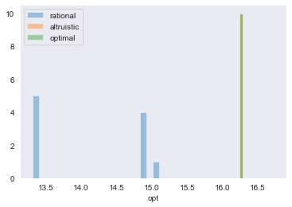
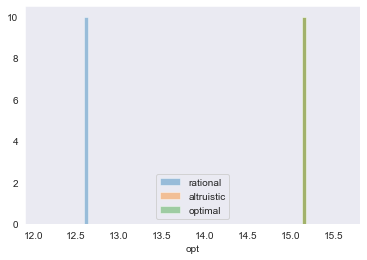
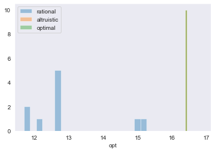
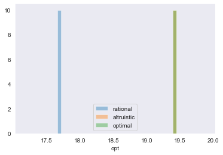
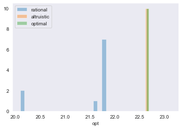

# Modelling the Outcomes of Rational and Altruistic Behaviour in Infectious Disease Situations

## Introduction

One model sometimes applied to infectious disease situations, and public health responses to such situations is that of economic externalities. By participating in activities in which there is a non-zero chance of infection, contagious individuals reap the private benefit of participating in the activity but impose an external cost on other participating individuals who are at increased risk of infection.

This is unlike a traditional externality in that the external cost is avoidable, by non-participation in the common activity. There is no analogous method to avoiding air pollution for example. The infectious disease situation is also further complicated in situations where it is unknown whether an individual is contagious or not. Often the best that can be said is that all individuals have an equal likelihood of being contagious. Thus, all individuals contribute equally to the external cost imposed. Reciprocal or symmetrical externalities are a further deviation from the standard externality model.  In the situation of second-hand smoke, for example, one party imposes an external cost on the other, but the reverse is not the case.

Given these differences between the traditional externality model and pandemic-like situations, it is difficult to transpose the conclusions from the former onto the latter. It would thus be fruitful to model this situation.

## Methodology

We aim to model the outcomes of participation in non-risk-free activities during a pandemic. Such activities may include grocery shopping, attending events, or participating in sports. Individuals who participate in such activities reap the private benefit of the activity. Each individual, who has a likelihood of being infectious, imposes an external cost on other participants, by increasing their probability of contracting the disease. For the sake of simplicity, we shall model a single activity, in which a group of people either participate or abstain.

Individuals in our model have two characteristics. The first characteristic, the benefit constant B, is the amount of positive utility that an individual would enjoy from participation in the activity. The second characteristic, the cost coefficient C, gives the relationship between the negative utility an individual would receive from participation in the activity and the total number of other participating individuals. The more other individuals participating in a given activity, the greater the probability of infection for a participating individual, and the greater the cost of participation.

Individuals in reality have different levels of benefit from participating in an activity, and different levels of susceptibility to infectious diseases. As such, individuals in our model are assigned random values of B and C, using a uniform distribution. Individuals who do not participate do not enjoy the benefits of participation nor incur the risk of infection, and they represent a baseline level of utility.

Our model seeks to determine the outcome of rational behavior in a pandemic-like situation. Given the benefit and cost conditions each individual faces, the model must determine which individuals decide to participate in the non-risk-free activity. This is non-trivial, as each individual decides whether or not to participate based on their expectation of how many others will participate. This creates a complex web of relationships for which there is no straightforward solution.

We have taken an iterative approach to determine the outcome of rational behavior. We begin with a random set of participants, and allow all entities to enter or exit the set based on their benefit and cost functions until an equilibrium is reached. This vaguely corresponds to individuals deciding to visit the supermarket and changing their minds upon realizing how crowded it is, or deciding to stay at home until they hear there is no queue at the store before heading down.

After initializing with a random set of participants (by deciding randomly for each entity whether to participate or not), calculations are performed for each individual.

For non-participating individuals, their expected net utility from participation is calculated. This value is equal to B – C * x, where x is the current number of participants. If the value of expected net utility is positive, the individual is indicated as wishing to participate. For participating individuals, their current net utility from participation is calculated. This value is equal to B – C * (x – 1). (x – 1) is used instead of x to represent the total number of other participants, excluding the individual for which the value is being calculated. If the current net utility is negative, the individual is worse off than the non-participation baseline, and is indicated as no longer wishing to participate.

Individuals wishing to participate and those wishing no longer to participate are then simultaneously moved into the appropriate categories.

Calculations and movements are then repeated until an equilibrium position is reached. At this point, there are no individuals who wish to participate that are not participating, and no individuals who do not wish to participate are participating. This state represents a best guess of which individuals will participate in the non-risk-free activity while acting in a rational, self-interested manner.

There was a possibility that different initial conditions would result in different equilibrium points being reached. As such, multiple initial sets of participants were used, and the results for each set were recorded.

An alternative model, simulating altruistic behavior was also developed. The altruistic behavior model was identical to the rational behavior model in all ways but one. In the altruistic behavior model, individuals make decisions on participation/non-participation based on the expected effect on total net utility as opposed to individual net utility. For non-participating individuals, the expected change in total net utility is equal to B – C * x – P, where P is the sum of the cost coefficients of all currently-participating individuals. B – C * x represents the change in individual net utility, while Z represents the external cost imposed on currently-participating individuals by the addition of another individual. For participating individuals, the value calculated is B – C * (x – 1) – Q, where Q is the sum of the cost coefficients of all other currently-participating individuals. This value represents the amount of utility that would be lost if the particular individual chooses not to participate.

Non-participating individuals are only indicated as wishing to participate if the expected change in total net utility is positive. Participating individuals are indicated as no longer wishing to participate if the amount of utility lost by their non-participation is negative.

This altruistic model simulates the behavior of individuals who consider the costs imposed on other participants in addition to their private benefits and costs in making participation/non-participation decisions.

A third kind of optimization simulation was performed. A simulated annealing algorithm was applied to estimate the theoretical optimum situation.

10 batches of 10 runs of models simulating 100 individuals were performed. All 10 runs in each batch used the same set of benefit and cost coefficients, however, the initial set of participants was randomized for each run. Each of the 10 batches used a randomized set of coefficients. The levels of utility at the equilibria of the rational algorithm, altruistic algorithm, and simulated annealing algorithm were recorded.

## Results

The following graphs show the distribution of utility for the three algorithms for each of the 10 batches of coefficients. The simulated annealing algorithm was only run once for each batch.


```python
import pandas as pd
import matplotlib.pyplot as plt
import seaborn as sns
```


```python
data = pd.read_csv("result.csv", index_col=0)
```


```python
sns.set_style("dark")
```


```python
sns.distplot(data.loc[0:9, "rat"], kde=False, bins=20, label="rational")
sns.distplot(data.loc[0:9, "alt"], kde=False, bins=20, label="altruistic")
sns.distplot(data.loc[0:9, "opt"], kde=False, bins=20, label="optimal")
plt.legend()
```


    <matplotlib.legend.Legend at 0x1d708d90>





```python
sns.distplot(data.loc[10:19, "rat"], kde=False, bins=20, label="rational")
sns.distplot(data.loc[10:19, "alt"], kde=False, bins=20, label="altruistic")
sns.distplot(data.loc[10:19, "opt"], kde=False, bins=20, label="optimal")
plt.legend()
```


    <matplotlib.legend.Legend at 0x1d7ca9e8>





```python
sns.distplot(data.loc[20:29, "rat"], kde=False, bins=20, label="rational")
sns.distplot(data.loc[20:29, "alt"], kde=False, bins=20, label="altruistic")
sns.distplot(data.loc[20:29, "opt"], kde=False, bins=20, label="optimal")
plt.legend()
```


    <matplotlib.legend.Legend at 0x1d862ec8>





```python
sns.distplot(data.loc[30:39, "rat"], kde=False, bins=20, label="rational")
sns.distplot(data.loc[30:39, "alt"], kde=False, bins=20, label="altruistic")
sns.distplot(data.loc[30:39, "opt"], kde=False, bins=20, label="optimal")
plt.legend()
```


    <matplotlib.legend.Legend at 0x1d8ede98>





```python
sns.distplot(data.loc[40:49, "rat"], kde=False, bins=20, label="rational")
sns.distplot(data.loc[40:49, "alt"], kde=False, bins=20, label="altruistic")
sns.distplot(data.loc[40:49, "opt"], kde=False, bins=20, label="optimal")
plt.legend()
```


    <matplotlib.legend.Legend at 0x1d989e98>





```python
sns.distplot(data.loc[50:59, "rat"], kde=False, bins=20, label="rational")
sns.distplot(data.loc[50:59, "alt"], kde=False, bins=20, label="altruistic")
sns.distplot(data.loc[50:59, "opt"], kde=False, bins=20, label="optimal")
plt.legend()
```


    <matplotlib.legend.Legend at 0x1d73a370>





```python
sns.distplot(data.loc[60:69, "rat"], kde=False, bins=20, label="rational")
sns.distplot(data.loc[60:69, "alt"], kde=False, bins=20, label="altruistic")
sns.distplot(data.loc[60:69, "opt"], kde=False, bins=20, label="optimal")
plt.legend()
```


    <matplotlib.legend.Legend at 0x1d875f70>





```python
sns.distplot(data.loc[70:79, "rat"], kde=False, bins=20, label="rational")
sns.distplot(data.loc[70:79, "alt"], kde=False, bins=20, label="altruistic")
sns.distplot(data.loc[70:79, "opt"], kde=False, bins=20, label="optimal")
plt.legend()
```


    <matplotlib.legend.Legend at 0x1dabc9d0>





```python
sns.distplot(data.loc[80:89, "rat"], kde=False, bins=20, label="rational")
sns.distplot(data.loc[80:89, "alt"], kde=False, bins=20, label="altruistic")
sns.distplot(data.loc[80:89, "opt"], kde=False, bins=20, label="optimal")
plt.legend()
```


    <matplotlib.legend.Legend at 0x1dbc4ad8>





```python
sns.distplot(data.loc[90:99, "rat"], kde=False, bins=20, label="rational")
sns.distplot(data.loc[90:99, "alt"], kde=False, bins=20, label="altruistic")
sns.distplot(data.loc[90:99, "opt"], kde=False, bins=20, label="optimal")
plt.legend()
```


    <matplotlib.legend.Legend at 0x1dc56d60>





```python
pd.set_option('display.max_row', None)
data
```


<div>
<style scoped>
    .dataframe tbody tr th:only-of-type {
        vertical-align: middle;
    }

    .dataframe tbody tr th {
        vertical-align: top;
    }

    .dataframe thead th {
        text-align: right;
    }
</style>
<table border="1" class="dataframe">
  <thead>
    <tr style="text-align: right;">
      <th></th>
      <th>rat</th>
      <th>alt</th>
      <th>opt</th>
    </tr>
  </thead>
  <tbody>
    <tr>
      <th>0</th>
      <td>21.059422</td>
      <td>21.970250</td>
      <td>21.970250</td>
    </tr>
    <tr>
      <th>1</th>
      <td>21.216621</td>
      <td>21.970250</td>
      <td>21.970250</td>
    </tr>
    <tr>
      <th>2</th>
      <td>19.644124</td>
      <td>21.970250</td>
      <td>21.970250</td>
    </tr>
    <tr>
      <th>3</th>
      <td>20.284153</td>
      <td>21.970250</td>
      <td>21.970250</td>
    </tr>
    <tr>
      <th>4</th>
      <td>17.947535</td>
      <td>21.970250</td>
      <td>21.970250</td>
    </tr>
    <tr>
      <th>5</th>
      <td>21.216621</td>
      <td>21.970250</td>
      <td>21.970250</td>
    </tr>
    <tr>
      <th>6</th>
      <td>17.947535</td>
      <td>21.970250</td>
      <td>21.970250</td>
    </tr>
    <tr>
      <th>7</th>
      <td>21.216621</td>
      <td>21.970250</td>
      <td>21.970250</td>
    </tr>
    <tr>
      <th>8</th>
      <td>17.947535</td>
      <td>21.970250</td>
      <td>21.970250</td>
    </tr>
    <tr>
      <th>9</th>
      <td>17.947535</td>
      <td>21.970250</td>
      <td>21.970250</td>
    </tr>
    <tr>
      <th>10</th>
      <td>10.420956</td>
      <td>16.242079</td>
      <td>16.253574</td>
    </tr>
    <tr>
      <th>11</th>
      <td>10.420956</td>
      <td>16.242079</td>
      <td>16.253574</td>
    </tr>
    <tr>
      <th>12</th>
      <td>14.084157</td>
      <td>16.242079</td>
      <td>16.253574</td>
    </tr>
    <tr>
      <th>13</th>
      <td>14.353940</td>
      <td>16.242079</td>
      <td>16.253574</td>
    </tr>
    <tr>
      <th>14</th>
      <td>12.982717</td>
      <td>16.242079</td>
      <td>16.253574</td>
    </tr>
    <tr>
      <th>15</th>
      <td>14.704727</td>
      <td>16.242079</td>
      <td>16.253574</td>
    </tr>
    <tr>
      <th>16</th>
      <td>10.420956</td>
      <td>16.242079</td>
      <td>16.253574</td>
    </tr>
    <tr>
      <th>17</th>
      <td>14.353940</td>
      <td>16.242079</td>
      <td>16.253574</td>
    </tr>
    <tr>
      <th>18</th>
      <td>14.084157</td>
      <td>16.242079</td>
      <td>16.253574</td>
    </tr>
    <tr>
      <th>19</th>
      <td>14.084157</td>
      <td>16.242079</td>
      <td>16.253574</td>
    </tr>
    <tr>
      <th>20</th>
      <td>17.168036</td>
      <td>19.709923</td>
      <td>19.709923</td>
    </tr>
    <tr>
      <th>21</th>
      <td>18.361213</td>
      <td>19.709923</td>
      <td>19.709923</td>
    </tr>
    <tr>
      <th>22</th>
      <td>15.411676</td>
      <td>19.709923</td>
      <td>19.709923</td>
    </tr>
    <tr>
      <th>23</th>
      <td>18.361213</td>
      <td>19.709923</td>
      <td>19.709923</td>
    </tr>
    <tr>
      <th>24</th>
      <td>15.411676</td>
      <td>19.709923</td>
      <td>19.709923</td>
    </tr>
    <tr>
      <th>25</th>
      <td>15.411676</td>
      <td>19.709923</td>
      <td>19.709923</td>
    </tr>
    <tr>
      <th>26</th>
      <td>18.361213</td>
      <td>19.709923</td>
      <td>19.709923</td>
    </tr>
    <tr>
      <th>27</th>
      <td>17.168036</td>
      <td>19.709923</td>
      <td>19.709923</td>
    </tr>
    <tr>
      <th>28</th>
      <td>17.168036</td>
      <td>19.709923</td>
      <td>19.709923</td>
    </tr>
    <tr>
      <th>29</th>
      <td>15.411676</td>
      <td>19.709923</td>
      <td>19.709923</td>
    </tr>
    <tr>
      <th>30</th>
      <td>17.603565</td>
      <td>18.821852</td>
      <td>18.821852</td>
    </tr>
    <tr>
      <th>31</th>
      <td>14.081200</td>
      <td>18.821852</td>
      <td>18.821852</td>
    </tr>
    <tr>
      <th>32</th>
      <td>17.603565</td>
      <td>18.821852</td>
      <td>18.821852</td>
    </tr>
    <tr>
      <th>33</th>
      <td>17.603565</td>
      <td>18.821852</td>
      <td>18.821852</td>
    </tr>
    <tr>
      <th>34</th>
      <td>18.018277</td>
      <td>18.821852</td>
      <td>18.821852</td>
    </tr>
    <tr>
      <th>35</th>
      <td>17.603565</td>
      <td>18.821852</td>
      <td>18.821852</td>
    </tr>
    <tr>
      <th>36</th>
      <td>17.603565</td>
      <td>18.821852</td>
      <td>18.821852</td>
    </tr>
    <tr>
      <th>37</th>
      <td>17.603565</td>
      <td>18.821852</td>
      <td>18.821852</td>
    </tr>
    <tr>
      <th>38</th>
      <td>17.603565</td>
      <td>18.821852</td>
      <td>18.821852</td>
    </tr>
    <tr>
      <th>39</th>
      <td>17.603565</td>
      <td>18.821852</td>
      <td>18.821852</td>
    </tr>
    <tr>
      <th>40</th>
      <td>18.824823</td>
      <td>20.301986</td>
      <td>20.301986</td>
    </tr>
    <tr>
      <th>41</th>
      <td>18.824823</td>
      <td>20.301986</td>
      <td>20.301986</td>
    </tr>
    <tr>
      <th>42</th>
      <td>18.824823</td>
      <td>20.301986</td>
      <td>20.301986</td>
    </tr>
    <tr>
      <th>43</th>
      <td>18.824823</td>
      <td>20.301986</td>
      <td>20.301986</td>
    </tr>
    <tr>
      <th>44</th>
      <td>18.824823</td>
      <td>20.301986</td>
      <td>20.301986</td>
    </tr>
    <tr>
      <th>45</th>
      <td>18.824823</td>
      <td>20.301986</td>
      <td>20.301986</td>
    </tr>
    <tr>
      <th>46</th>
      <td>18.824823</td>
      <td>20.301986</td>
      <td>20.301986</td>
    </tr>
    <tr>
      <th>47</th>
      <td>18.824823</td>
      <td>20.301986</td>
      <td>20.301986</td>
    </tr>
    <tr>
      <th>48</th>
      <td>18.824823</td>
      <td>20.301986</td>
      <td>20.301986</td>
    </tr>
    <tr>
      <th>49</th>
      <td>18.824823</td>
      <td>20.301986</td>
      <td>20.301986</td>
    </tr>
    <tr>
      <th>50</th>
      <td>14.898966</td>
      <td>16.236396</td>
      <td>16.236396</td>
    </tr>
    <tr>
      <th>51</th>
      <td>15.106637</td>
      <td>16.236396</td>
      <td>16.236396</td>
    </tr>
    <tr>
      <th>52</th>
      <td>14.898966</td>
      <td>16.236396</td>
      <td>16.236396</td>
    </tr>
    <tr>
      <th>53</th>
      <td>13.309937</td>
      <td>16.236396</td>
      <td>16.236396</td>
    </tr>
    <tr>
      <th>54</th>
      <td>13.309937</td>
      <td>16.236396</td>
      <td>16.236396</td>
    </tr>
    <tr>
      <th>55</th>
      <td>13.309937</td>
      <td>16.236396</td>
      <td>16.236396</td>
    </tr>
    <tr>
      <th>56</th>
      <td>14.898966</td>
      <td>16.236396</td>
      <td>16.236396</td>
    </tr>
    <tr>
      <th>57</th>
      <td>14.898966</td>
      <td>16.236396</td>
      <td>16.236396</td>
    </tr>
    <tr>
      <th>58</th>
      <td>13.309937</td>
      <td>16.236396</td>
      <td>16.236396</td>
    </tr>
    <tr>
      <th>59</th>
      <td>13.309937</td>
      <td>16.236396</td>
      <td>16.236396</td>
    </tr>
    <tr>
      <th>60</th>
      <td>12.586599</td>
      <td>15.137426</td>
      <td>15.137426</td>
    </tr>
    <tr>
      <th>61</th>
      <td>12.586599</td>
      <td>15.137426</td>
      <td>15.137426</td>
    </tr>
    <tr>
      <th>62</th>
      <td>12.586599</td>
      <td>15.137426</td>
      <td>15.137426</td>
    </tr>
    <tr>
      <th>63</th>
      <td>12.586599</td>
      <td>15.137426</td>
      <td>15.137426</td>
    </tr>
    <tr>
      <th>64</th>
      <td>12.586599</td>
      <td>15.137426</td>
      <td>15.137426</td>
    </tr>
    <tr>
      <th>65</th>
      <td>12.586599</td>
      <td>15.137426</td>
      <td>15.137426</td>
    </tr>
    <tr>
      <th>66</th>
      <td>12.586599</td>
      <td>15.137426</td>
      <td>15.137426</td>
    </tr>
    <tr>
      <th>67</th>
      <td>12.586599</td>
      <td>15.137426</td>
      <td>15.137426</td>
    </tr>
    <tr>
      <th>68</th>
      <td>12.586599</td>
      <td>15.137426</td>
      <td>15.137426</td>
    </tr>
    <tr>
      <th>69</th>
      <td>12.586599</td>
      <td>15.137426</td>
      <td>15.137426</td>
    </tr>
    <tr>
      <th>70</th>
      <td>12.666845</td>
      <td>16.374013</td>
      <td>16.374013</td>
    </tr>
    <tr>
      <th>71</th>
      <td>12.666845</td>
      <td>16.374013</td>
      <td>16.374013</td>
    </tr>
    <tr>
      <th>72</th>
      <td>15.065830</td>
      <td>16.374013</td>
      <td>16.374013</td>
    </tr>
    <tr>
      <th>73</th>
      <td>12.221695</td>
      <td>16.374013</td>
      <td>16.374013</td>
    </tr>
    <tr>
      <th>74</th>
      <td>11.690112</td>
      <td>16.374013</td>
      <td>16.374013</td>
    </tr>
    <tr>
      <th>75</th>
      <td>12.666845</td>
      <td>16.374013</td>
      <td>16.374013</td>
    </tr>
    <tr>
      <th>76</th>
      <td>15.257737</td>
      <td>16.374013</td>
      <td>16.374013</td>
    </tr>
    <tr>
      <th>77</th>
      <td>12.666845</td>
      <td>16.374013</td>
      <td>16.374013</td>
    </tr>
    <tr>
      <th>78</th>
      <td>12.666845</td>
      <td>16.374013</td>
      <td>16.374013</td>
    </tr>
    <tr>
      <th>79</th>
      <td>11.690112</td>
      <td>16.374013</td>
      <td>16.374013</td>
    </tr>
    <tr>
      <th>80</th>
      <td>17.665523</td>
      <td>19.393046</td>
      <td>19.393046</td>
    </tr>
    <tr>
      <th>81</th>
      <td>17.665523</td>
      <td>19.393046</td>
      <td>19.393046</td>
    </tr>
    <tr>
      <th>82</th>
      <td>17.665523</td>
      <td>19.393046</td>
      <td>19.393046</td>
    </tr>
    <tr>
      <th>83</th>
      <td>17.665523</td>
      <td>19.393046</td>
      <td>19.393046</td>
    </tr>
    <tr>
      <th>84</th>
      <td>17.665523</td>
      <td>19.393046</td>
      <td>19.393046</td>
    </tr>
    <tr>
      <th>85</th>
      <td>17.665523</td>
      <td>19.393046</td>
      <td>19.393046</td>
    </tr>
    <tr>
      <th>86</th>
      <td>17.665523</td>
      <td>19.393046</td>
      <td>19.393046</td>
    </tr>
    <tr>
      <th>87</th>
      <td>17.665523</td>
      <td>19.393046</td>
      <td>19.393046</td>
    </tr>
    <tr>
      <th>88</th>
      <td>17.665523</td>
      <td>19.393046</td>
      <td>19.393046</td>
    </tr>
    <tr>
      <th>89</th>
      <td>17.665523</td>
      <td>19.393046</td>
      <td>19.393046</td>
    </tr>
    <tr>
      <th>90</th>
      <td>21.820804</td>
      <td>22.617396</td>
      <td>22.631225</td>
    </tr>
    <tr>
      <th>91</th>
      <td>21.820804</td>
      <td>22.617396</td>
      <td>22.631225</td>
    </tr>
    <tr>
      <th>92</th>
      <td>21.820804</td>
      <td>22.617396</td>
      <td>22.631225</td>
    </tr>
    <tr>
      <th>93</th>
      <td>20.096733</td>
      <td>22.617396</td>
      <td>22.631225</td>
    </tr>
    <tr>
      <th>94</th>
      <td>21.820804</td>
      <td>22.617396</td>
      <td>22.631225</td>
    </tr>
    <tr>
      <th>95</th>
      <td>20.096733</td>
      <td>22.617396</td>
      <td>22.631225</td>
    </tr>
    <tr>
      <th>96</th>
      <td>21.820804</td>
      <td>22.617396</td>
      <td>22.631225</td>
    </tr>
    <tr>
      <th>97</th>
      <td>21.820804</td>
      <td>22.617396</td>
      <td>22.631225</td>
    </tr>
    <tr>
      <th>98</th>
      <td>21.608617</td>
      <td>22.617396</td>
      <td>22.631225</td>
    </tr>
    <tr>
      <th>99</th>
      <td>21.820804</td>
      <td>22.617396</td>
      <td>22.631225</td>
    </tr>
  </tbody>
</table>
</div>


## Discussion

A few preliminary observations can be made from the results above.

First, altruistic behavior consistently arrives at the same equilibrium point while rational behavior does not.

Second, altruistic behavior consistently arrives at an equilibrium point with utility very close or exactly equal to the theoretical optimum.

Third, rational behavior almost never arrives at an equilibrium point with utility equal to the theoretical optimum.

The results of our model would suggest that rational behavior is not an optimal approach to pandemic-like situations. Rational behavior does not result in an ideal, utility-maximizing outcome.

One argument in favor of allowing unconstrained rational behavior has been that individuals who choose to participate in a non-risk-free activity, insofar as they are fully aware of the risks involved, have decided to do so voluntarily, and have thus made the utility-maximizing decision for themselves. If all participating individuals are making individually utility-maximizing decisions, it might follow that collective utility would likewise be maximized. The results above demonstrate that this is not the case. While each individual is making the utility-maximizing decision, all individuals are also faced with worse decisions as a result of systematic over-participation. They make the best choice out of two options which would otherwise have been more appealing if there were fewer participants.

In contrast, altruistic behavior seems to be a near-perfect approach to the pandemic-like situation. While the dynamics in such a situation are very complex, having each individual act in an altruistic manner consistently results in near-perfect, or perfect outcomes.

There is no perfect translation for the results of this hypothetical model to practical situations. Nonetheless, there are a few points that can be made.

It can perhaps be assumed (and possibly confirmed by game-theoretical modeling) that a greater amount or a greater degree of altruistic behavior would result in more ideal outcomes in a pandemic-like situation. It might thus make sense to consider policy with this objective.

The model we developed did not simulate lockdowns, mask mandates, travel restrictions, or other commonly applied policy tools in response to the COVID-19 pandemic. The efficacy of those policies is perhaps better dealt with using empirical rather than theoretical means. It can, however, be noted that rational behavior typically arrived at equilibriums with total net utility around 80% that of the estimated maximum. This might be considered by some to be an acceptable result.

In a pandemic-like situation, externalities are even more complicated than how they are modeled here. The externality imposed by a single participant extends not only to other participants in the same activity, but also to others at further degrees of separation. These costs would be extremely difficult to model. We have neglected these costs, and it would be reasonable to assume that our model thus understates the magnitude of the externality imposed, and hence the net utility loss of rational as opposed to altruistic behavior. Also, in a pandemic situation, the priority tends to be on preventing exponential spread as opposed to maximizing utility in a single instance.

The model used here may be more analogous to the situation of traffic congestion, in which externalities are more bounded to a particular group (commuters in the same area or stretch of road). In such a situation, external costs are imposed symmetrically, by each driver onto every other, and the external costs can be avoided by foregoing the private benefit (by taking the train instead).

The crucial takeaway from the modeling conducted here is that altruistic behavior is capable of achieving optimal or very-near-optimal results even in extremely complex economic situations. Whereas blunt, technical instruments like taxation and quotas do not consistently maximize utility. While members of society have typically been treated by policymakers as rational economic agents, we might consider encouraging them to be altruistic moral agents instead.
